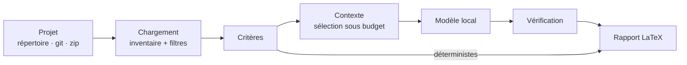

# AI Project Reviewer

Un outil qui **évalue automatiquement un projet Java** et produit un rapport LaTeX noté.

On lui donne un projet — un répertoire, un dépôt git ou une archive. Il en dresse
l'inventaire, l'évalue selon une série de critères, et produit un document structuré : une note
par critère, les points forts, les points faibles, les recommandations, et les problèmes
localisés qui justifient chaque note.

**Entrée** : un projet Java.
**Sortie** : `evaluation.tex`.

Une partie des critères est confiée à un modèle de langage local ; l'autre est calculée sans
modèle. Le modèle n'écrit jamais le rapport : il remplit des champs, et c'est le programme qui
construit le document.

---

## Démarrage rapide

### Avec Docker, sans rien installer

```bash
docker/mvn.sh test                       # tests unitaires
docker/mvn.sh package                    # jar dans target/
docker/run-analysis.sh /chemin/du/projet # évaluation isolée
```

Détails et réglages du modèle : [docker/README.md](docker/README.md).

### Avec les outils installés sur la machine

Prérequis : JDK 25, Maven 3.9, et [Ollama](https://ollama.com) pour le mode complet.

```bash
# macOS
brew install maven ollama
ollama pull qwen2.5-coder:7b

mvn package

# Évaluation en ligne de commande
java -jar target/ai-reviewer.jar --project /chemin/du/projet

# Sans modèle : seuls les critères déterministes sont notés
java -jar target/ai-reviewer.jar --project . --offline

# Interface web
java -jar target/ai-reviewer.jar --serve
```

`--help` liste toutes les options, `--list-criteria` liste les critères disponibles.

---

## Les critères

Neuf critères, dans deux familles. On choisit ceux qu'on veut avec `--criteria`, ou en cochant
des cases dans l'interface web.

| Critère | Identifiant | Comment |
|---|---|---|
| Organisation du projet | `project-structure` | déterministe |
| Présence de tests | `tests` | déterministe |
| Documentation | `documentation` | déterministe |
| Architecture et modularité | `architecture` | modèle |
| Lisibilité du code | `readability` | modèle |
| Respect des principes SOLID | `solid` | modèle |
| Pertinence des patrons de conception | `design-patterns` | modèle |
| Gestion des erreurs | `error-handling` | modèle |
| Sécurité | `security` | modèle |

Les critères déterministes comptent des fichiers : exacts, gratuits, instantanés, et ils
fonctionnent sans qu'aucun modèle ne tourne. Les autres envoient au modèle une sélection
d'extraits choisie pour eux.

**Ajouter un critère** : écrire une classe qui implémente `Criterion`, l'ajouter à la liste de
`EvaluationServiceFactory`. Rien d'autre ne change — ni le moteur, ni le rapport, ni
l'interface, ni l'historique.

---

## Comment ça marche



| Étape | Ce qu'elle fait |
|---|---|
| Chargement | Importe le projet, classe ses fichiers, applique les règles d'inclusion |
| Critères | Chaque critère note le projet sur un aspect |
| Contexte | Choisit les extraits envoyés au modèle, sous un budget de jetons |
| Modèle | Interroge un modèle local, avec réessai et traçabilité |
| Vérification | Écarte ce que le modèle a inventé |
| Rapport | Produit le document — LaTeX, ou Markdown pendant le développement |

---

## Organisation du code

Architecture Modèle-Vue-Contrôleur. Les dépendances vont dans un seul sens :
**Vue → Contrôleur → Service → Briques → Modèle**.

```
src/main/java/com/reviewerai/
├── Main.java        point d'entrée : arguments, câblage, choix de la vue
├── model/           les données échangées (records immuables)
├── config/          réglages d'une évaluation
├── service/         orchestration et câblage des dépendances
├── project/         chargement du projet, typage et filtrage des fichiers
├── criteria/        les critères d'évaluation
├── context/         ce qui part au modèle
├── llm/             accès au modèle, résilience, traçabilité
├── verify/          filtrage des signalements
├── report/          production du document
├── history/         évaluations passées
├── diff/  graph/    comparaison de versions et graphe d'appel
├── controller/      contrôleur MVC
├── view/            vues : cli/ et web/
└── util/            lecture défensive du projet évalué
```

Les explications détaillées sont dans la Javadoc, publiée sur GitHub Pages. Les choix
d'architecture sont justifiés dans [docs/DESIGN.md](docs/DESIGN.md), les conventions de code
dans [CLAUDE.md](CLAUDE.md), le fonctionnement de l'équipe dans
[CONTRIBUTING.md](CONTRIBUTING.md).

---

## Sécurité

Le projet évalué est considéré comme **non fiable** : on le lit, on ne l'exécute jamais.

| Risque | Mesure |
|---|---|
| Exécution de code malveillant | Aucun build du projet évalué, parsing uniquement |
| Archive piégée | Chemins d'extraction contrôlés, volume et nombre d'entrées plafonnés |
| Injection de prompt | Code encadré et annoncé comme donnée ; modèle sans aucun outil ; réponse validée |
| Modèle qui invente | Tout signalement citant un fichier non montré est écarté |
| Exécution via le rapport | Échappement LaTeX intégral — `\input` et `\write18` neutralisés |
| Script injecté dans la page | `textContent` partout, plus un en-tête `Content-Security-Policy` |
| Fichiers piégés | Taille maximale, liens symboliques non suivis, chemins hors projet refusés |
| Fuite de secrets | Modèle local, donc aucune clé ; le journal ne contient jamais de prompt |

Pour évaluer un projet venant de l'extérieur, passer par le conteneur : voir
[docker/README.md](docker/README.md).

---

## Travailler sur le projet

Le travail restant est dans les [issues](../../issues) — il n'y a pas de `TODO` dans le code.
Une branche par issue, partant de `main`, fusionnée quand la CI est verte. Le détail et les
raisons de ce choix sont dans [CONTRIBUTING.md](CONTRIBUTING.md).

```bash
mvn test              # tests unitaires
mvn javadoc:javadoc   # documentation dans target/reports/apidocs
mvn package           # jar exécutable dans target/
```

---

## Versions

Vérifiées le 10/09/2026. Elles bougent vite : revérifier avant le jour J.

| Composant | Version |
|---|---|
| Java (JDK) | 25 (LTS) |
| Maven | 3.9.16 |
| JGit | 7.8 (le numéro complet contient un suffixe de date) |
| JavaParser + Symbol Solver | 3.28.2 |
| JGraphT | 1.5.3 |
| LangChain4j | 1.20.0 |
| Jackson | 2.22.2 |
| JUnit | 5.14.4 |
| Ollama | 0.33.3 |
